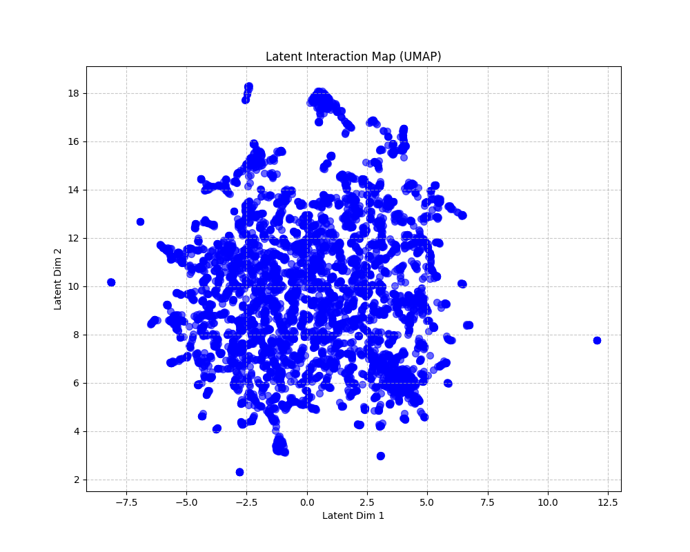
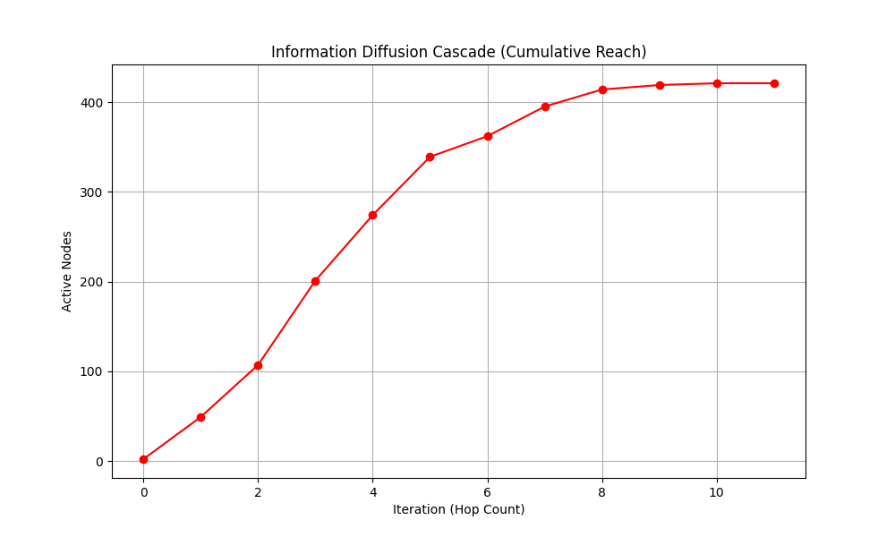
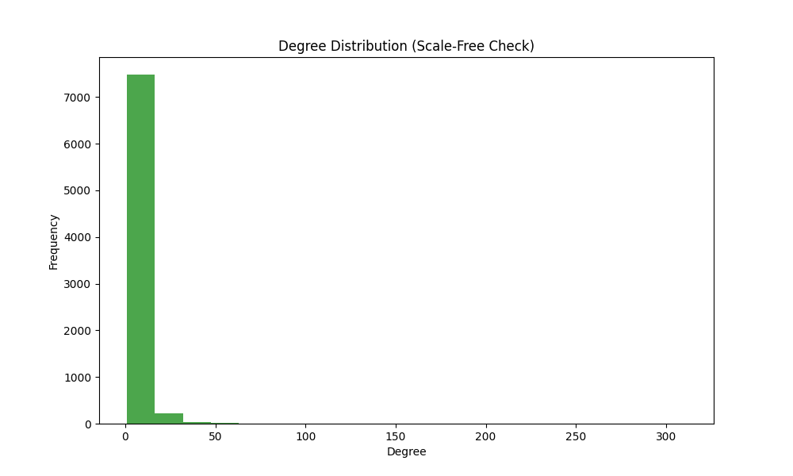

#  Mining the Shadow Brokers: Reddit Information Diffusion & SNA Pipeline

> **"The internet is loud, but influence is quiet."**

*Mining the Shadow Brokers* is an advanced, end-to-end Data Science and Social Network Analysis (SNA) pipeline designed to map structural influence and information diffusion on Reddit. By discarding vanity metrics like raw upvotes and focusing on network topology, this project identifies the true gatekeepers of information—the **Shadow Brokers**.

---

##  Key Features

- **Bipartite Graph Flattening**: Converts hierarchical Reddit comment trees into directed, weighted User-to-User interaction networks.
- **Anti-Fluff Engine**: Employs quantile-based edge pruning to strip out long-tail noise and isolate the core conversational backbone.
- **Latent Behavioral Mapping**: Generates node embeddings using **Node2Vec** and visualizes echo chambers via **UMAP**.
- **Brokerage Identification**: Calculates **Burt's Constraint Index** to discover structural holes and the broker nodes that bridge them.
- **Information Cascade Simulation**: Uses the **Independent Cascade Model (ICM)** to simulate viral rumor spread and test network disruption strategies.

---

##  Pipeline & Methodology

### 1. Data Ingestion & Preprocessing

- Uses Reddit data and nested comment structures to construct interaction networks.
- Applies feature scaling and preprocessing to ensure algorithms prioritize structural position over raw activity volume.
- Cleans and transforms network data for downstream graph analytics.

### 2. Graph Representation & Clustering

Even if two users never directly interact, they may still occupy similar positions in the network. This project captures those similarities using Node2Vec embeddings and projects them into two-dimensional space using UMAP.



> **Latent Map (UMAP)** — Reveals behavioral clusters and echo chambers by grouping users with similar structural roles.

### 3. Motif & Structural Hole Analysis

- Examines network motifs and recurring interaction patterns.
- Detects influential bridge nodes that connect otherwise disconnected communities.
- Uses Burt's Constraint Index to identify brokers occupying structural holes.

### 4. Diffusion Simulation (ICM)

Information propagation is modeled using the Independent Cascade Model to understand how content spreads across communities and how targeted interventions affect diffusion.



> **Diffusion Curve** — Demonstrates information spread over time under different intervention strategies.

---

##  Key Findings

1. **Popularity ≠ Influence**

   Nodes with the highest number of connections are not necessarily the most influential. True influence often comes from occupying strategic positions between communities.

2. **The Power of Brokers**

   Broker nodes play a disproportionately important role in maintaining information flow between communities.

3. **Sentiment Homophily**

   Dense communities tend to develop strong internal sentiment alignment, creating echo chambers that resist external influence.

4. **Scale-Free Structure**

   The pruned Reddit network exhibits characteristics commonly observed in real-world social networks.



> **Degree Distribution Histogram** — Illustrates the heavy-tailed connectivity pattern typical of social networks.

---

##  Installation

### Clone the Repository

```bash
git clone https://github.com/your-username/JIM-JAM.git
cd JIM-JAM
```

### Create a Virtual Environment (Optional)

```bash
python -m venv .venv
source .venv/bin/activate
```

Windows:

```bash
.venv\Scripts\activate
```

### Install Dependencies

```bash
pip install -r requirements.txt
```

> Requires Python 3.12 or newer.

---

## ⚙️ Configuration

Configure Reddit API credentials in:

- `config.py`

or using environment variables.

---

##  Usage

### Data Collection

```bash
python local_collector.py
```

### Global Analysis

```bash
python global_analyzer.py
```

### Latent Space Modeling

```bash
python latent_modeler.py
```

### Diffusion Simulation

```bash
python diffusion_simulator.py
```

### Advanced Analytics

```bash
python advanced_analytics.py
```

---

##  Project Structure

```text
.
├── advanced_analytics.py
├── batch_pipeline_runner.py
├── config.py
├── diffusion_simulator.py
├── global_analyzer.py
├── latent_modeler.py
├── local_collector.py
├── neo4j_schema.cypher
├── README.md
├── latent_map.png
├── diffusion_curve.png
└── degree_distribution.png
```

---

## 🔬 Technologies Used

- Python
- NetworkX
- Node2Vec
- UMAP
- NumPy
- Pandas
- Matplotlib
- Reddit API
- Neo4j

---

## Project Goal

The objective of this project is to move beyond surface-level engagement metrics and uncover the hidden structural mechanisms that govern information diffusion, influence, and community formation in online social networks.

---

*Created for advanced Social Network Analysis, Information Diffusion Research, and Digital Community Intelligence.*
